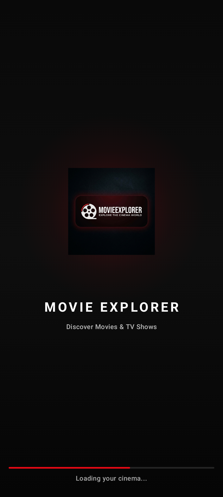
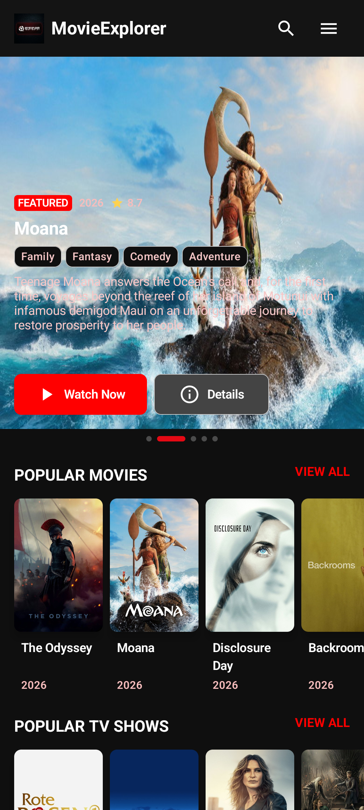
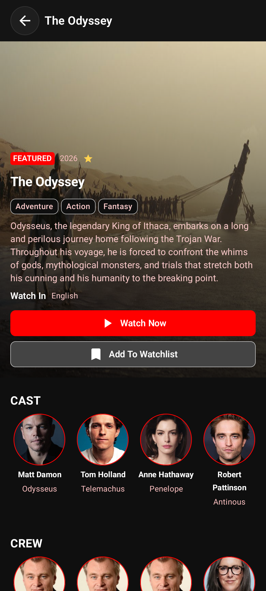
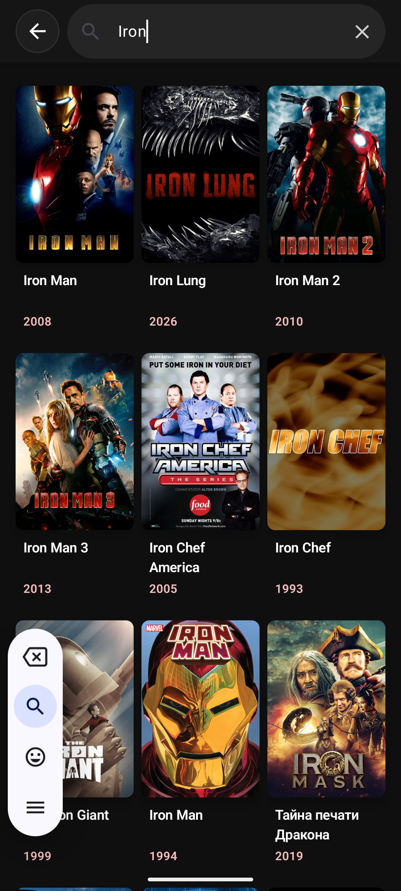
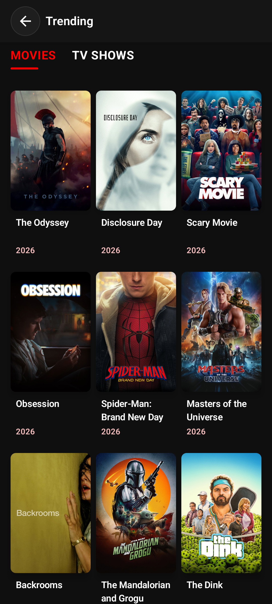

# 🎬 Movie Explorer

A modern **Movies & TV Shows Explorer** built with **Kotlin** and **Compose Multiplatform**, showcasing modern Android development practices with **MVI**, **Clean Architecture**, and a responsive cross-platform UI. The application allows users to discover trending, popular, and top-rated movies & TV shows, search content, explore detailed information, browse image galleries, and watch trailers.

> 🚀 Built as a portfolio project to demonstrate modern Android & Kotlin Multiplatform development.

---

## 📱 Demo


---

# 🚀 Highlights

- Built with Compose Multiplatform
- Follows MVI + Clean Architecture
- Supports Android, iOS, Desktop & Web
- Responsive UI across multiple screen sizes
- Ktor networking with Kotlinx Serialization
- Pagination, Search & Error Handling
- Modular and scalable project structure

---

# ✨ Features

- 🎬 Browse Trending, Popular & Top Rated Movies
- 📺 Browse TV Shows
- 🔍 Powerful Search
- 📄 Detailed Movie & TV Information
- 🎭 Cast & Crew
- ⭐ Ratings & Reviews
- 🖼️ Full Screen Image Gallery
- ▶️ Watch Official Trailers
- 🌍 Cross-Platform Support (Android, iOS, Desktop & Web)
- 📱 Responsive UI for Multiple Screen Sizes
- 🌙 Modern Material 3 Design
- ⚡ Pagination
- 🔄 Loading, Error & Empty States

---

# 🛠 Tech Stack

### Language

- Kotlin

### UI

- Compose Multiplatform
- Material 3
- Navigation Compose
- Responsive Layout

### Architecture

- MVI (Model–View–Intent)
- Clean Architecture
- Repository Pattern
- Modular Feature-Based Structure

### Dependency Injection

- Koin

### Networking

- Ktor Client
- Kotlinx Serialization

### Asynchronous Programming

- Kotlin Coroutines
- Flow
- StateFlow

### Image Loading

- Coil 3

### API

- TMDB (The Movie Database)

---

# 📂 Project Structure

```
movie_explorer
│
├── core
│   ├── components
│   ├── dummy
│   ├── navigation
│   ├── ui
│   └── utils
│
├── data
│   ├── dto
│   ├── mapper
│   ├── remote
│   └── repository
│
├── di
│   ├── AppModule.kt
│   ├── DetailsModule.kt
│   ├── HomeModule.kt
│   ├── Koin.kt
│   ├── ListingModule.kt
│   └── NetworkModule.kt
│
├── domain
│   ├── model
│   ├── repository
│   └── usecase
│
├── features
│   ├── splash
│   ├── home
│   ├── details
│   ├── listingScreen
│   └── imageGallery
│
├── App.kt
├── Greeting.kt
├── GreetingUtil.kt
└── Platform.kt
```

---

# 📸 Screenshots

## Android

| Splash | Home |
|--------|------|
|  |  |

| Details | Search |
|---------|--------|
|  |  |

| Listing | Gallery |
|---------|---------|
|  |  |

---

## Desktop (macOS)

| Home | Details |
|------|---------|
|  |  |

| Search | Listing |
|--------|----------|
|  |  |

---

# 🏛 Architecture

The project follows **Clean Architecture** with the **MVI (Model–View–Intent)** pattern to keep business logic separated from the presentation layer.

```
Presentation (MVI)
        │
        ▼
     Use Cases
        │
        ▼
   Repository
        │
        ▼
Remote Data Source (Ktor)
```

---

# 🚀 Getting Started

### Clone the repository

```bash
git clone https://github.com/code-with-anil-mandyal/movie-explorer-cmp.git
```

### Open the project

Open the project using the latest version of **Android Studio**.

### Build & Run

Run the Android, iOS, Web or Desktop target.

---

# 📦 Libraries Used

- Compose Multiplatform
- Kotlin Coroutines
- Flow & StateFlow
- Koin
- Ktor Client
- Coil 3
- Kotlinx Serialization
- Navigation Compose
- Material 3

---

# 🌐 API

This project uses **The Movie Database (TMDB) API**.

🔗 https://www.themoviedb.org/

---

# 👨‍💻 Author

**Anil Kumar**

- GitHub: https://github.com/code-with-anil-mandyal
- LinkedIn: https://www.linkedin.com/in/anil-mandyal

---

# 📄 License

This project is licensed under the MIT License.

---

## ⭐ Support

If you found this project helpful, consider giving it a **⭐ Star** on GitHub.
